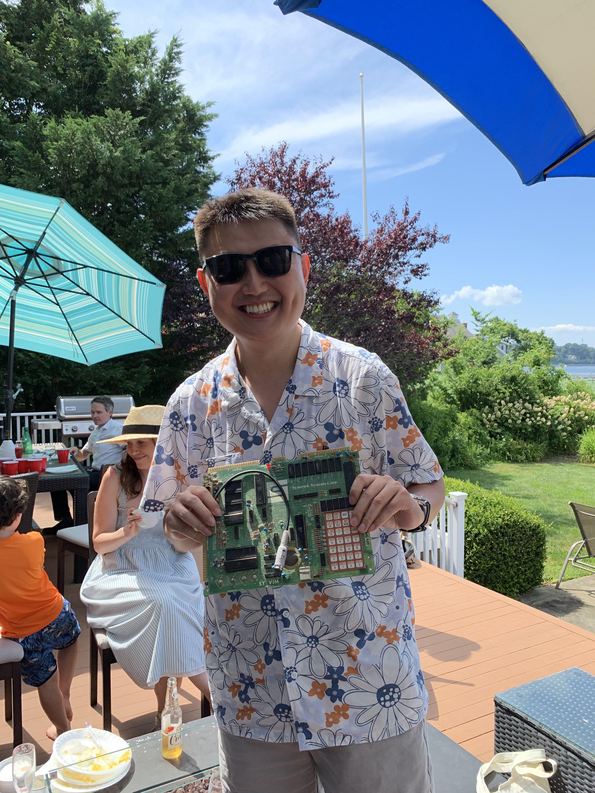

### About Me (Jiachen Zhu / 朱家晨）
I am a fifth-year PhD candidate in Computer Science at NYU Courant, advised by [Yann LeCun](http://yann.lecun.com/). \
I am also a Visiting Researcher at FAIR, Meta, where I am hosted by [Zhuang Liu](https://liuzhuang13.github.io/) and [Koustuv Sinha](https://koustuvsinha.com/).

### Education
- PhD, Computer Science, [New York University](https://cs.nyu.edu/home/index.html), 2020 - Now
- MSc, Computer Science, [New York University](https://cs.nyu.edu/home/index.html), 2018 - 2020
- BSc, Computer Science, [The Hong Kong Polytechnic University](https://www.comp.polyu.edu.hk/), 2010 - 2015

### Research Interests
My research focuses on self-supervised learning for images and videos, as well as pretraining vision encoders for vision-language models (VLMs). I am also interested in understanding the design of all kind of neural network architectures.

### Papers

[Scaling Language-Free Visual Representation Learning](https://davidfan.io/webssl/)

[Transformers without Normalization](https://jiachenzhu.github.io/DyT/)

[MetaMorph: Multimodal Understanding and Generation via Instruction Tuning](https://arxiv.org/abs/2412.14164v1)

[Variance-Covariance Regularization Improves Representation Learning](https://arxiv.org/abs/2306.13292)

[VoLTA: Vision-Language Transformer with Weakly-Supervised Local-Feature Alignment](https://arxiv.org/abs/2210.04135)

[Masked Siamese ConvNets](https://arxiv.org/abs/2206.07700)

[TiCo: Transformation Invariance and Covariance Contrast for Self-Supervised Visual Representation Learning](https://arxiv.org/abs/2206.10698)

### Contact
jiachen DOT zhu AT nyu DOT edu

[Google Scholar](https://scholar.google.com/citations?user=sao1OhsAAAAJ&hl=en)

### Appendix
[My Favourite Illusion!](http://illusionoftheyear.com/2009/05/the-illusion-of-sex/)

Two ideas that I find both shockingly simple and extremely clever: [1](https://en.wikipedia.org/wiki/Merton_model), [2](https://en.wikipedia.org/wiki/Convolutional_neural_network)

