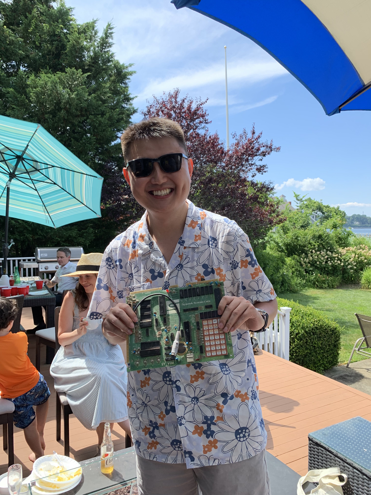

### About Me (Jiachen Zhu / 朱家晨)
I am a Research Scientist at [Skild AI](https://www.skild.ai/), where I am currently working on building VLA/VA models with strong vision capabilities. If you are interested in an internship or full-time role at Skild AI, feel free to reach out! \
Prior to joining Skild, I received my PhD from NYU in June 2025, advised by [Yann LeCun](http://yann.lecun.com/). I also spent an extended period at FAIR, Meta AI, where I worked closely with [Jing Li](https://jingli.io/), [Yubei Chen](https://yubeichen.com/), and [Zhuang Liu](https://liuzhuang13.github.io/).

### Education
- PhD, Computer Science, [New York University](https://cs.nyu.edu/home/index.html), 2020 - 2025
- MSc, Computer Science, [New York University](https://cs.nyu.edu/home/index.html), 2018 - 2020
- BSc, Computer Science, [The Hong Kong Polytechnic University](https://www.comp.polyu.edu.hk/), 2010 - 2015

### Research Interests
My current research focuses on leveraging in-the-wild videos to improve VLA models, particularly their vision capabilities. I am also interested in building an agentic layer on top of VLA models to accomplish long-horizon tasks that require memory and planning.

During my PhD, I worked on self-supervised learning for images and videos, as well as pretraining vision encoders for vision-language models (VLMs). I also maintain a broad interest in understanding the design principles behind various neural network architectures.

### Papers

For the most up-to-date paper list, please see my [Google Scholar](https://scholar.google.com/citations?user=sao1OhsAAAAJ&hl=en).

[Transformers without Normalization](https://jiachenzhu.github.io/DyT/)

[MetaMorph: Multimodal Understanding and Generation via Instruction Tuning](https://arxiv.org/abs/2412.14164v1)

[Scaling Language-Free Visual Representation Learning](https://davidfan.io/webssl/)

[Variance-Covariance Regularization Improves Representation Learning](https://arxiv.org/abs/2306.13292)

[VoLTA: Vision-Language Transformer with Weakly-Supervised Local-Feature Alignment](https://arxiv.org/abs/2210.04135)

[Masked Siamese ConvNets](https://arxiv.org/abs/2206.07700)

[TiCo: Transformation Invariance and Covariance Contrast for Self-Supervised Visual Representation Learning](https://arxiv.org/abs/2206.10698)

### Contact
jiachen DOT zhu AT nyu DOT edu

### Appendix
[My Favourite Illusion!](http://illusionoftheyear.com/2009/05/the-illusion-of-sex/)

Two ideas that I find both shockingly simple and extremely clever: [1](https://en.wikipedia.org/wiki/Merton_model), [2](https://en.wikipedia.org/wiki/Convolutional_neural_network)

